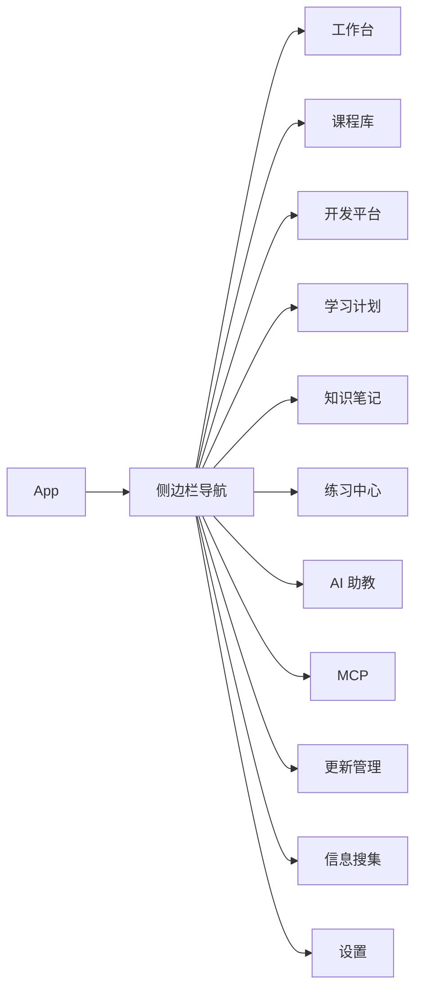
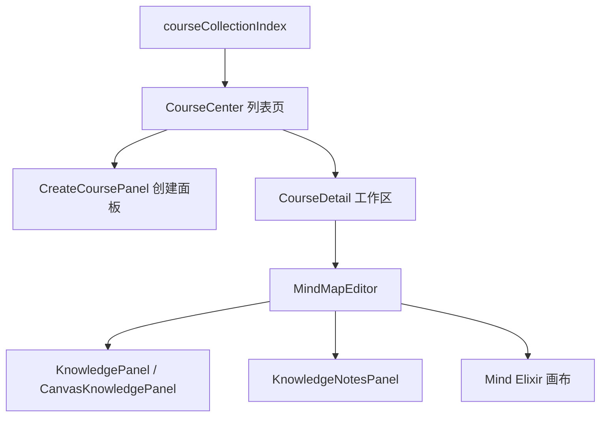
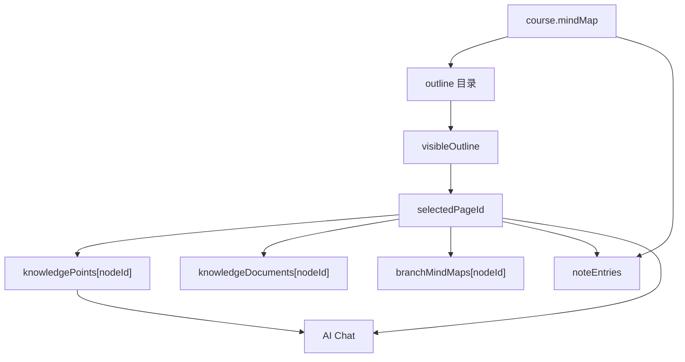
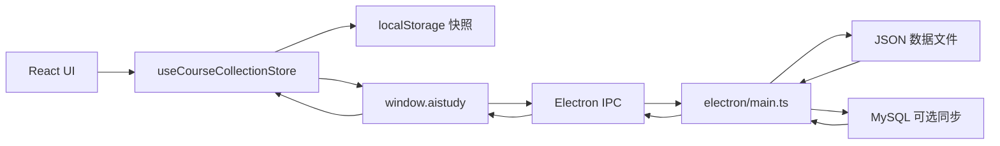
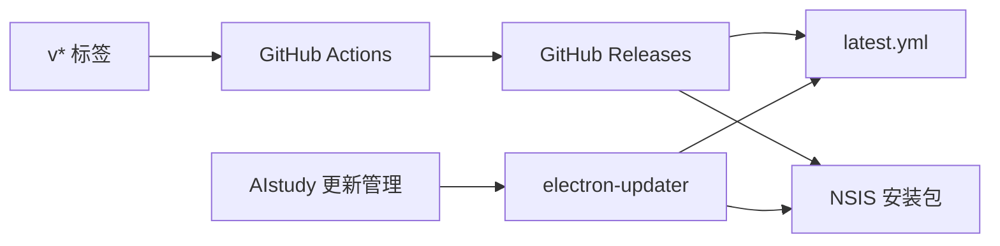
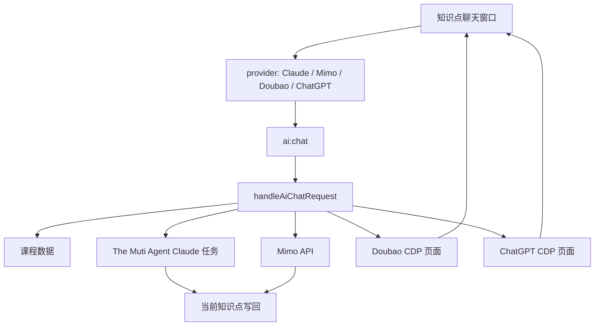
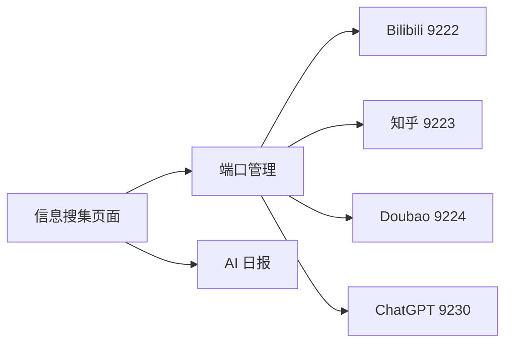

# AIstudy 功能关系总览

本文档用于约束功能关系和变更影响面。后续改功能时，先确认变更属于哪个模块、写入哪份数据、影响哪条链路，再动代码。

## 总原则

- 课程库和开发平台共用同一套底层工作区逻辑，只通过库类型、文案和数据源区分。
- 知识点、知识笔记、思维导图都从同一份 Mind Elixir 树派生，不各自维护独立目录。
- 主进程只负责本机能力和持久化，渲染进程只负责界面状态和用户交互。
- AI 问答默认只回答；只有明确编辑请求才能写回当前知识点。
- 发布只使用 `release\win-unpacked\AIstudy.exe`，不再创建旁路发布目录。

## 顶层导航关系

## 课程库与开发平台共享关系

课程库和开发平台使用同一套 `Course` 数据结构和同一套 `CourseDetail -> MindMapEditor` 工作区。

| 维度 | 课程库 | 开发平台 | 共同点 |
| --- | --- | --- | --- |
| collection id | `courses` | `developer` | 都走 `CourseCollectionConfig` |
| 本地缓存 key | `aistudy:courses:v1` | `aistudy:developer-documents:v1` | 渲染进程先落 localStorage |
| 主进程文件 | `courses.json` | `developer-documents.json` | 都走 JSON + MySQL 同步层 |
| MySQL 表 | `courses` | `developer_documents` | 都保存完整 payload |
| 工作区组件 | `CourseDetail` | `CourseDetail` | 同一组件，不允许分叉复制 |
| 内容模式 | 知识点/知识笔记/思维导图 | 需求内容/需求笔记/结构导图 | 只是文案不同 |

新增功能应优先挂到共享层：

## 工作区内部关系

`MindMapEditor` 是当前耦合最高的组件，负责目录、知识点、笔记、导图和 AI 聊天的交汇。

必须保持这些边界：

- `outline` 只能从 `mindMap` 或分支导图数据生成。
- `collapsedOutlineIds` 只影响目录可见性，不能阻止思维导图模式打开父级分支。
- `hideParentKnowledgePages` 只影响知识点/笔记页面，不影响思维导图分支打开。
- `knowledgePoints` 保存兼容 HTML。
- `knowledgeDocuments` 保存 Canvas Editor 结构。
- `branchMindMaps` 是分支画布缓存，写回主图必须通过统一分支同步函数。

## 课程库核心逻辑基准

课程库里的“测试”知识库用于同步确认课程库核心逻辑；工程侧用 `docs/course-library-core-logic.md` 记录同一份规则，并用 `npm run check:course-logic` 固化检查。

必须保持这些规则：

- 主思维导图的 `nodeData` 是唯一真实目录树；目录、知识点、知识笔记和分支导图都按同一个 `nodeId` 对齐。
- 父级节点和非最末子级都可以承载自己的知识点正文；没有手写正文时，可以临时显示下级提纲，但不能自动落成正式内容。
- 目录折叠只影响左侧目录可见性，不能改父子级，也不能被自动定位逻辑强制回弹。
- 分支导图只能写回对应分支根节点；同步开启时再同步到主图和相关父级分支，不能串到其他章节。
- `numberedOutlineSnapshot` 只能冻结编号显示，不能覆盖真实 `parentId` 或 `depth`。
- 自动生成的父级提纲必须带机器标记，清理逻辑不能因为用户正文里出现“思维导图”等词就删除内容。

## 数据流

持久化规则：

- 渲染进程负责立即保存 localStorage，保证界面响应。
- 主进程负责写入 JSON，并在可用时同步 MySQL。
- JSON 与 MySQL 同时存在时，以时间戳较新的为准，并异步回填另一端。
- 新增库类型必须同时补齐：渲染层 `CourseCollectionConfig`、主进程 `databaseCollectionIndex`、preload API、IPC handler、数据文件名、验证清单。

## 自动更新关系

更新管理分为两层：本地版本记录来自 `src/updateLog.ts`，远端安装更新来自 GitHub Releases。

必须保持这些边界：

- `npm run pack` 只用于本机固定入口 `release\win-unpacked\AIstudy.exe`。
- `npm run dist` 用于正式自动更新发版，必须生成安装包、`latest.yml` 和 blockmap。
- B 设备只能安装 GitHub Releases 中已发布的版本，不能直接根据 git commit 自动更新。
- GitHub 更新源必须能被 B 设备匿名访问；源码仓库保持私有时，应把安装包发布到公开的 Release 仓库。
- 更新管理页面只触发检查、下载和重启安装；安装包下载、校验和替换由 `electron-updater` 处理。

## AI 问答关系

当前边界：

- Doubao 和 ChatGPT 是问答通道，只返回文本，不写知识点。
- Claude 和 Mimo 可在明确编辑请求时写回当前课程的当前知识点。
- 现有 `ai:chat` 以课程库为主数据源；如果开发平台也要 AI 写回，必须先给请求增加 collection id，再按 collection 写入对应数据库，不能直接复用课程写回逻辑。
- 回复提取只能取模型真实回答，不得混入推荐问题、输入框内容、免责声明或历史问题。

## 信息搜集与端口关系

端口规则：

- 端口管理属于本机浏览器登录态，不属于课程数据。
- Doubao/ChatGPT 聊天依赖已登录 CDP 页面。
- 端口启动逻辑不得强制抢前台，除非用户主动点击登录窗口。

## 高风险联动点

| 变更位置 | 可能波及 | 必测项 |
| --- | --- | --- |
| `Course` 类型字段 | 课程库、开发平台、JSON、MySQL、AI 上下文 | 新建课程、新建需求、旧数据加载 |
| `courseCollectionIndex` | 侧边栏、列表页、创建页、工作区文案 | 两个库都能创建并进入 |
| `MindMapEditor` 状态 | 知识点、笔记、导图、AI 聊天、目录折叠 | 三个模式切换和目录点击 |
| `buildOutline` / `getVisibleOutline` | 目录、笔记分页、分支定位 | 父级和叶子节点都能打开 |
| `branchMindMaps` 同步 | 分支导图、主导图、知识点插入分支 | 第四章股票这类父级分支 |
| `knowledgePoints` / `knowledgeDocuments` | 旧 HTML、Canvas Editor、AI 写回 | 编辑、保存、重启后恢复 |
| `ai:chat` | Claude/Mimo/Doubao/ChatGPT、课程数据写回 | 问答和编辑分别测试 |
| `electron/main.ts` 数据层 | JSON、MySQL、备份、恢复 | MySQL 有/无两种状态 |
| 打包目录 | 用户实际运行版本 | 只存在默认 `release` |

## 变更流程

每次改功能按这个顺序走：

1. 定位功能所属模块：导航、集合、工作区、知识点、导图、AI、端口、MCP、更新。
2. 确认写入对象：只读界面、当前 collection、当前 node、全局设置、本机数据、外部浏览器。
3. 优先修改共享入口，不复制课程库或开发平台代码。
4. 涉及工作区时同时检查知识点、笔记、思维导图三种模式。
5. 涉及目录时同时检查折叠状态、父级节点、叶子节点和分支导图。
6. 涉及 AI 时同时检查普通问答、编辑写回、超时和回复提取。
7. 更新 `src/updateLog.ts`。
8. 执行 `npm run check:system`、`npm run lint`，需要交付 exe 时再执行 `npm run pack`。

## 后续拆分方向

当前系统仍是大文件结构，后续拆分应按以下边界做，不要按页面随意切：

- `src/domain/courseCollection.ts`：Course、Collection 配置、创建和规范化。
- `src/domain/mindMap.ts`：导图、目录、分支同步、笔记派生。
- `src/domain/knowledgeDocument.ts`：HTML 与 Canvas 文档互转、格式刷、流程图。
- `src/features/workspace/`：CourseDetail 和 MindMapEditor 拆分。
- `src/features/aiChat/`：聊天窗口和 provider 状态。
- `electron/dataCollections.ts`：JSON/MySQL 双写集合层。
- `electron/aiProviders/`：Claude、Mimo、Doubao、ChatGPT 独立 provider。

拆分前先补行为测试，保证拆代码不改变功能。
